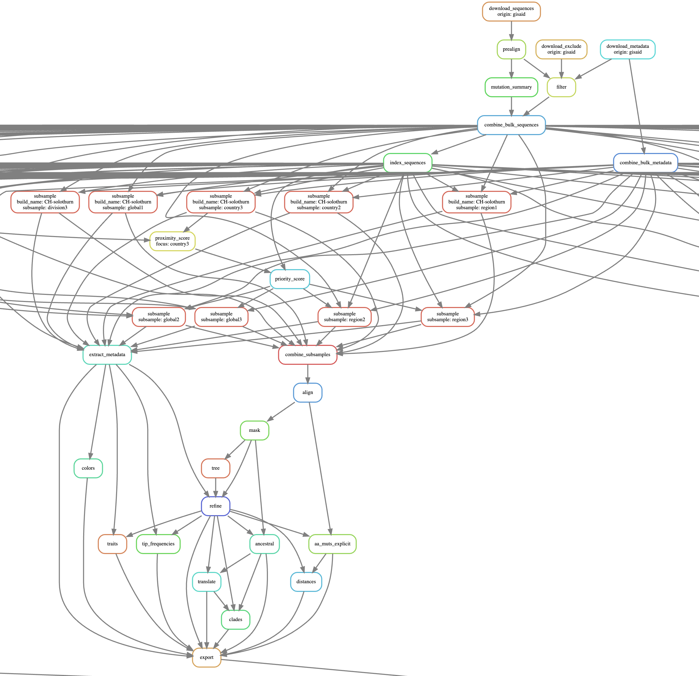

# Workflow Documentation

## Overview

## ToDo

Discuss small changes with Richard

Trace the workflow back, step by step.

Observe how snakefile is processed

Make clear that nextstrain remote only goes to s3 bucket 

Browser crash when selecting Pango

## Open Questions

Weird output of yaml.dump with ordered dictionaries -> make normal?

How does Snakemake generate 'builds' array?

What's passed to lambdas as argument?

Why is so little sampled in UK? Surely interesting stuff going on there

How to upload timestamped builds

Why does Snakemake not output rule name when running? That'd be good to know

`rule all:` generates requests based on builds defined in config variable

Can `clean_all` be defined as `clean` plus preprocessed? *DRY*...

What is variable config? How is it assembled?

How can Snakefile be debugged?

How to document rules?

What does a jobscript do exactly?

How is jobscript called, by what, how processed further

How can I debug a snakemake rule? Step by step see how it pulls in what where?

How do cluster and jobscript work together?

How does it detect whether it's on cluster or not? It suddenly asks for cores to be provided, when run locally.